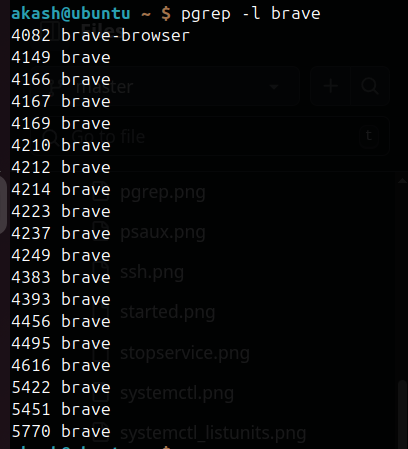
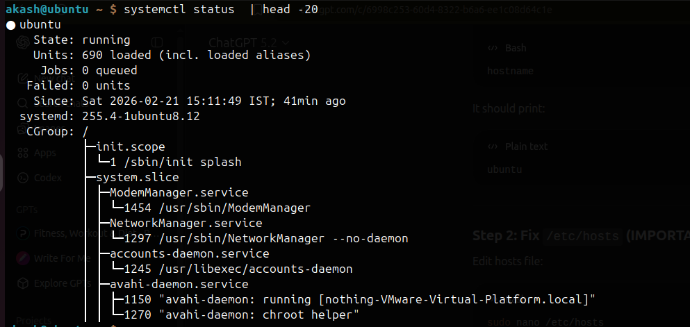
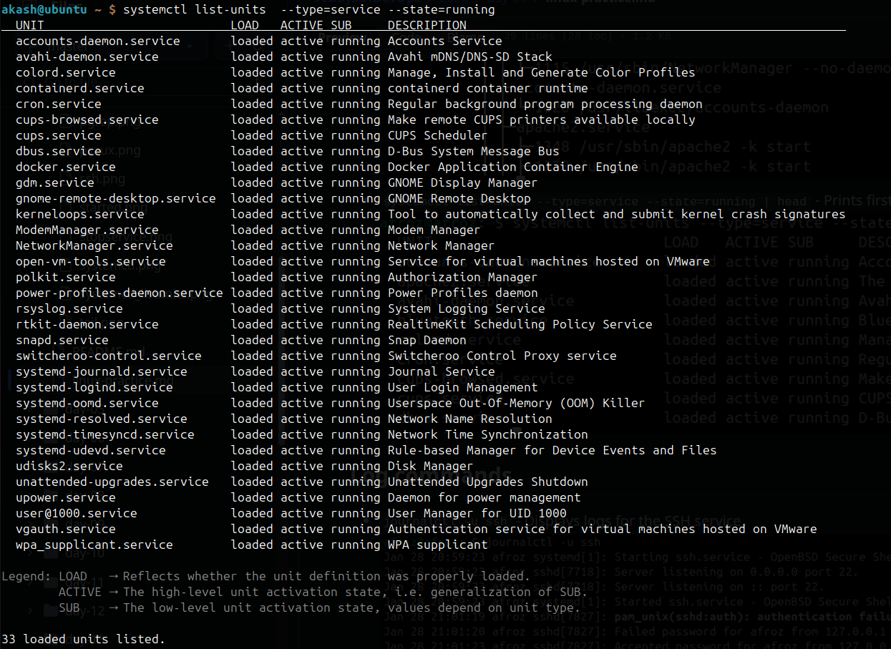
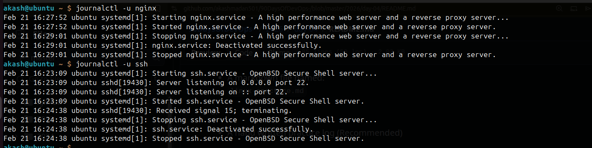
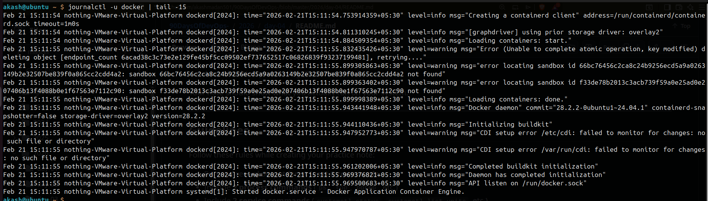
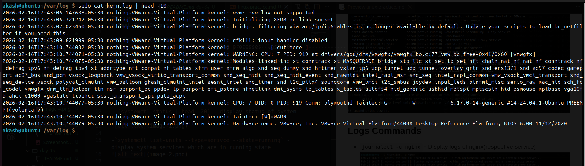
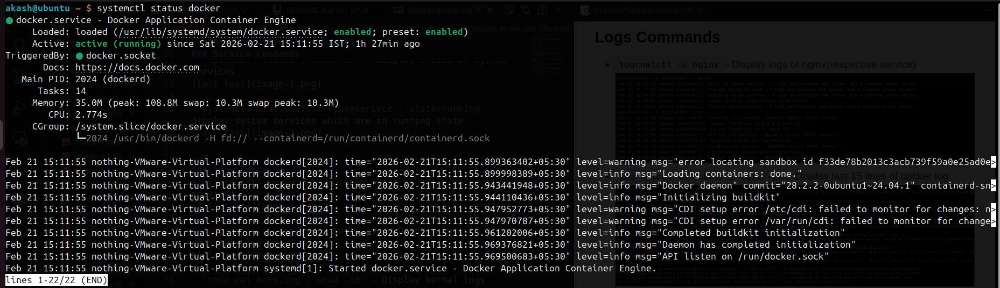
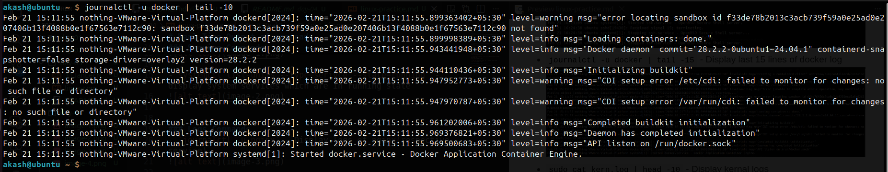
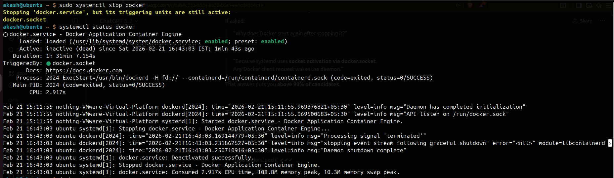
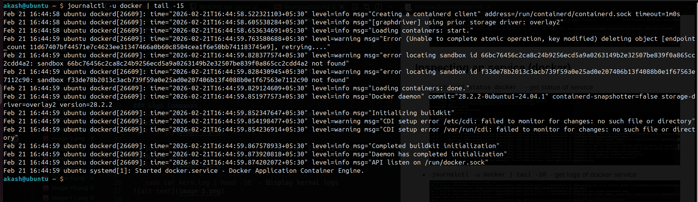

# Real Time Output of Commands

---

## Process Commands

- `ps aux | tail -20`  
  List running processes (last 20 lines)

---

- `pgrep -l brave`  
  Display PID and name of the Brave browser process

---

## Service Commands

- `systemctl status | head -20`  
  Display status of system services

---

- `systemctl list-units --type=service --state=running`  
  Display system services which are in running state

---

## Logs Commands

- `journalctl -u nginx`  
  Display logs of nginx (respective service)

---

- `journalctl -u docker | tail -15`  
  Display last 15 lines of Docker logs

---

- `journalctl -k | head -10`  
  Display kernel logs

---

## Inspecting a Service (Docker)

- `systemctl status docker`  
  Get status of Docker service

---

- `journalctl -u docker | tail -10`  
  Get logs of Docker service

---

- `systemctl stop docker`  
  Stop Docker service

---

- `journalctl -u docker | tail -15`  
  Verify logs after stopping Docker

---

## Notes

- Docker may restart automatically due to `docker.socket`
- Logs are managed by `journald` on systemd-based systems