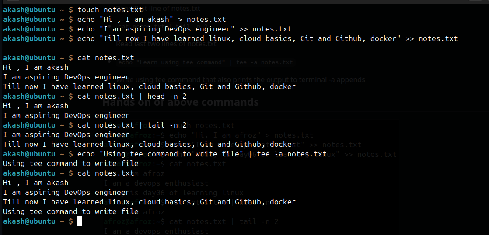

# Read and Write file using linux

Create a textfile with name notes.txt
- `touch notes.txt`               

Write to notes.txt
-  `echo "Hi , I am akash" > notes.txt`         

Append to notes.txt
- `echo "I am aspiring DevOps engineer" >> notes.txt`
- `echo "Till now I have learned linux, cloud basics, Git and Github, docker" >> notes.txt`

Read notes 
- `cat notes.txt`

Read first 2 lines
- `cat notes.txt | head -n 2`

Read last 2 lines
- `cat notes.txt | tail -n 2`

Write using tee command (-a flag) which also prints output on terminal
- `echo "Using tee command to write file" | tee -a notes.txt`

 