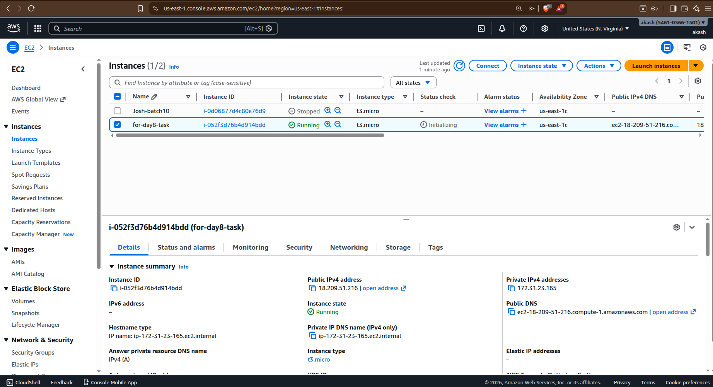
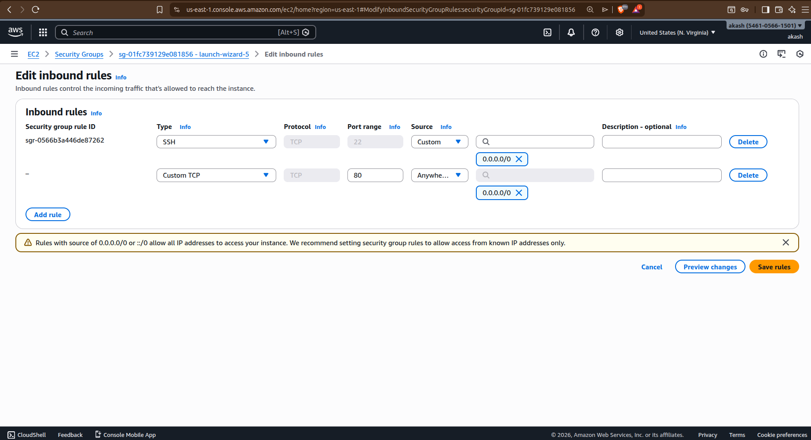
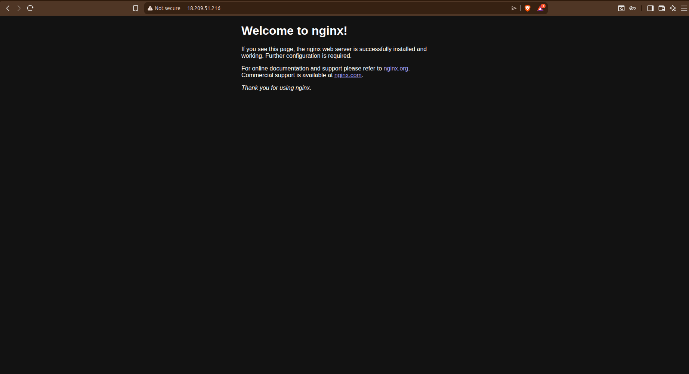
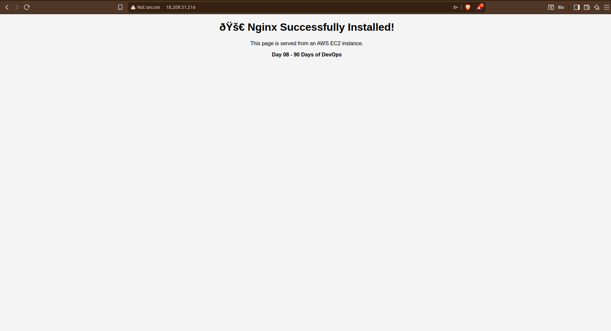
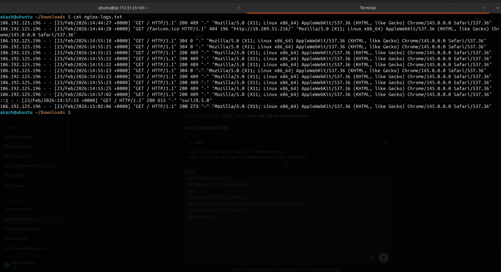

# Day 08 – Deploy Nginx on AWS EC2 and Collect Access Logs

## Objective
- Launch an AWS EC2 instance (Free Tier)
- Install and configure Nginx on Ubuntu
- Expose port 80 to the internet
- Serve default and custom web pages
- Generate and collect Nginx access logs
- Download logs to local machine using SCP

---

## Step 1: Create an EC2 Instance (AWS Free Tier)

- Logged in to AWS Console
- Navigated to **EC2 → Launch Instance**
- Selected **Ubuntu Server (Free Tier eligible)**
- Instance type: `t3.micro`
- Key pair: `demo2`
- Security Group rules:
  - SSH (22) → My IP / Anywhere
- Launched the instance successfully



---

## Step 2: Connect to EC2 Instance

```bash
ssh -i demo2.pem ubuntu@<EC2-PUBLIC-IP>
```

Verified successful login to the Ubuntu EC2 instance.

Step 3: Update System Packages
```
sudo apt update
```

Step 4: Install Nginx
```
sudo apt install nginx -y
```


Check Nginx status:
```
systemctl status nginx
```


Start Nginx service:
```
sudo systemctl start nginx
```

Step 5: Expose Port 80

Edited EC2 Security Group inbound rules

Allowed:

Custom TCP → Port 80 → Source: 0.0.0.0/0



Step 6: Access Default Nginx Page

Opened browser and visited:

http://<EC2-PUBLIC-IP>:80

✅ Default “Welcome to nginx!” page loaded successfully.



Step 7: Locate Nginx Web Root

Checked Nginx document root:
```
sudo nginx -T | grep root
```
Output confirmed:
```
root /var/www/html;
```


Step 8: Customize Nginx Web Page

Navigated to web root:
```
cd /var/www/html
```


Edited default page:
```
sudo vim index.nginx-debian.html
```

Reloaded Nginx:
```
sudo systemctl reload nginx
```


- Refreshed browser and verified custom page.



Step 9: Generate Traffic

Accessed the page multiple times from browser

Sent requests from terminal:
```
curl http://localhost
curl -I http://localhost
```
Step 10: View Nginx Access Logs
```
sudo cat /var/log/nginx/access.log
```

Step 11: Save Logs to a File
```
sudo cat /var/log/nginx/access.log > ~/nginx-logs.txt
```


Verify file:
```
ls -lh ~/nginx-logs.txt
```


Step 12: Download Logs to Local Machine (SCP)

From local machine:
```
scp -i demo2.pem ubuntu@<EC2-PUBLIC-IP>:~/nginx-logs.txt .
```


Verified locally:
```
cat nginx-logs.txt
```
