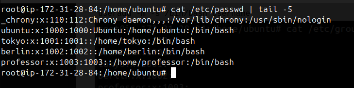
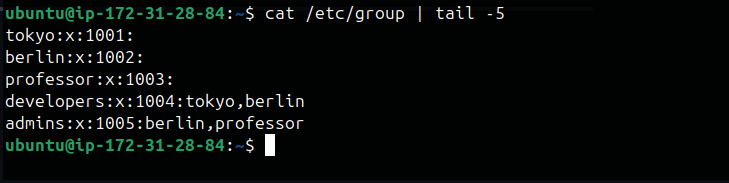
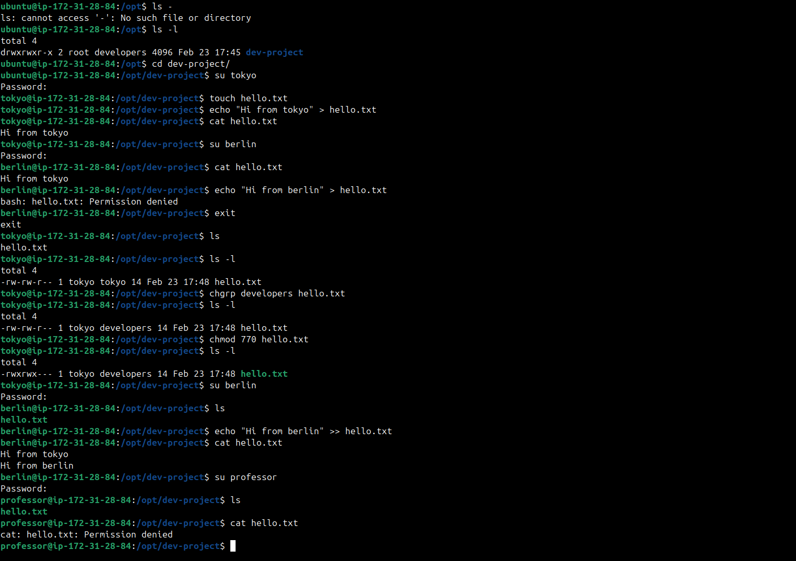
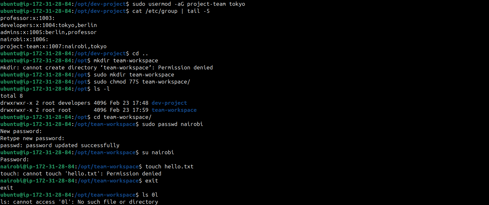
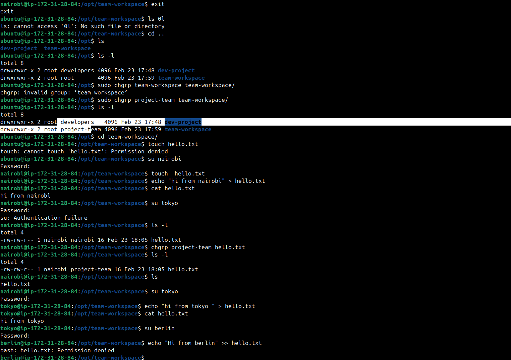

Task 2: Create Groups (10 minutes)
Create two groups:

developers
admins
Verify: Check /etc/group

## Linux User & Group Management Challenge

## User created with home dir and shell

`useradd -m -s /bin/bash username`

## Groups created
`groupadd groupname`

## Assign Users to Groups 

`usermod -aG <groupname> <username>`

## Shared Directory

- Create directory: /opt/dev-project    -   `sudo mkdir /opt/dev-project `
- Set group owner to developers     -  `chgrp developers dev-project`
- Set permissions to 775 (rwxrwxr-x)        -       `sudo chmod 775 dev-project`
- Test by creating files as tokyo and berlin  

## Team Workspace 
- Create user nairobi with home directory  -      `sudo useradd -m -s /bin/bash nairobi`
- Create group project-team      -         `groupadd project-team`
- Add nairobi and tokyo to project-team         -  `usermod -aG project-team nairobi`  & `usermod -aG project-team tokyo`
- Create /opt/team-workspace directory  -      `mkdir /opt/team-workspace`
- Set group to project-team, permissions to 775  -   `chmod 775 /opt/team-workspace`
- Test by creating file as nairobi    -     

