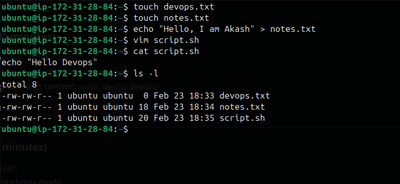
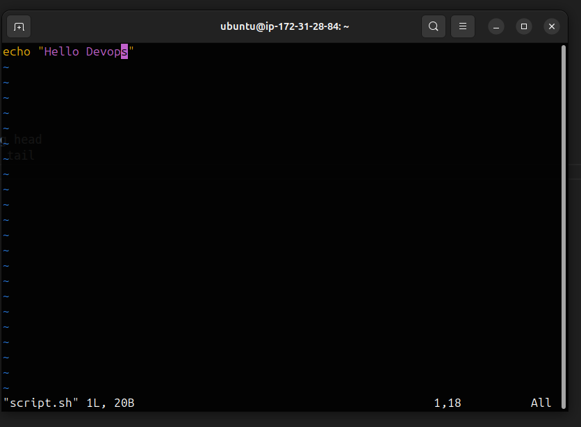
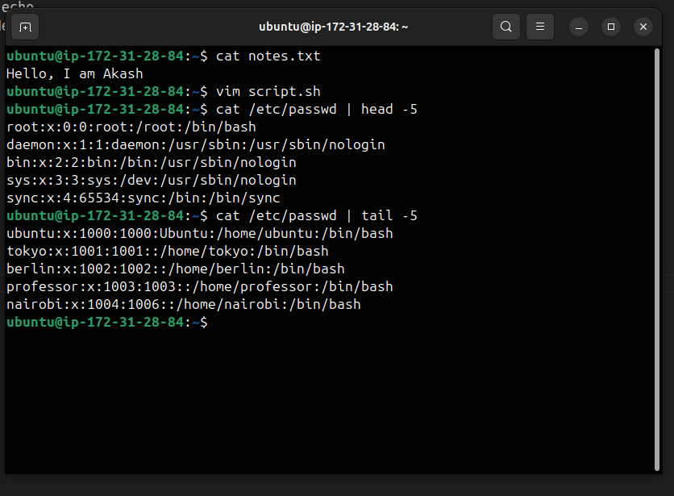
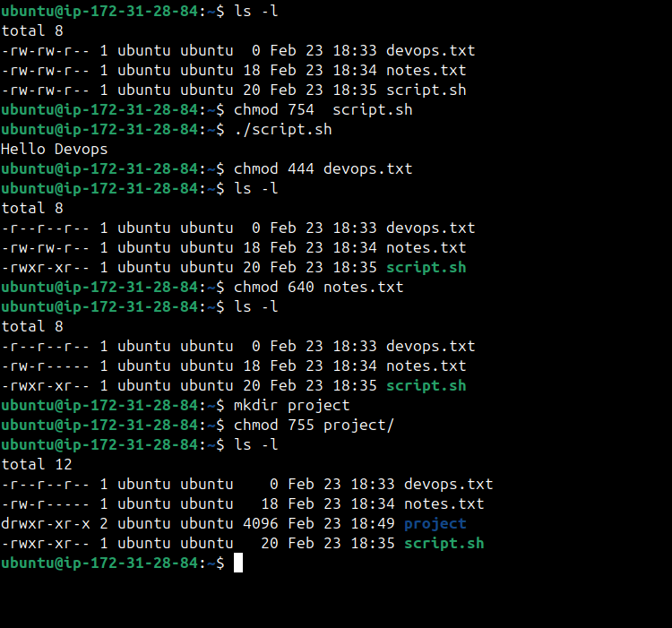
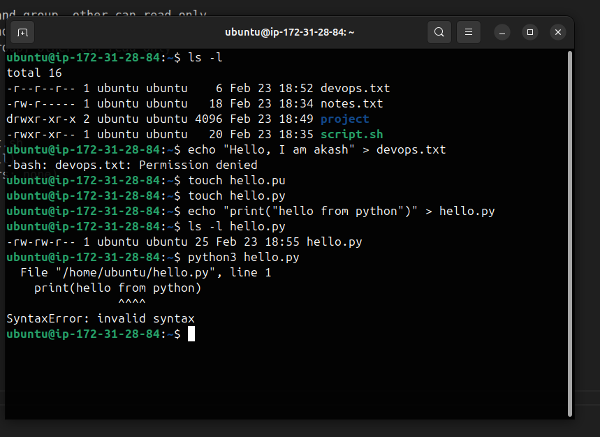

## Create Files 

- Create empty file devops.txt using touch
- Create notes.txt with some content using cat or echo
- Create script.sh using vim with content: echo "Hello DevOps"
- Verify: ls -l to see permissions




## Read Files (10 minutes)

- Read notes.txt using cat
- View script.sh in vim read-only mode
- Display first 5 lines of /etc/passwd using head
- Display last 5 lines of /etc/passwd using tail








## Understand Permissions 
Format: rwxrwxrwx (owner-group-others)

r = read (4), w = write (2), x = execute (1)
Check your files: ls -l devops.txt notes.txt script.sh

Answer: What are current permissions? Who can read/write/execute?
```
ubuntu@ip-172-31-28-84:~$ ls -l
total 8
-rw-rw-r-- 1 ubuntu ubuntu  0 Feb 23 18:33 devops.txt
-rw-rw-r-- 1 ubuntu ubuntu 18 Feb 23 18:34 notes.txt
-rw-rw-r-- 1 ubuntu ubuntu 20 Feb 23 18:35 script.sh
```
- devops.txt file can be read and write by owner and group, other can read only
- notes.txt file can be read and write by owner and group, other can read only
- scripts.sh can be read and write by owner and group, other can read only


## Modify Permissions 

- Make script.sh executable → run it with ./script.sh
- Set devops.txt to read-only (remove write for all)
- Set notes.txt to 640 (owner: rw, group: r, others: none)
- Create directory project/ with permissions 755
- Verify: ls -l after each change




## Test Permissions 

- Try writing to a read-only file - what happens?
- Try executing a file without execute permission
- Document the error messages



Answer: System throws error saying permission denied, we can write file which are read-only, cann't execute without permission.


## What I learned

- How to create file and view their permission.
- How to assign permissions to file/directory.
- What can be possible error when file execution failed.