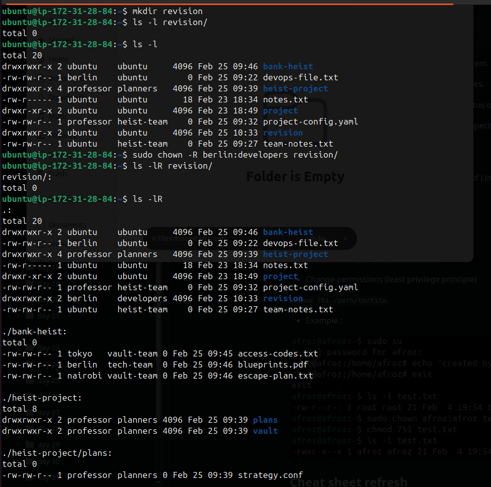
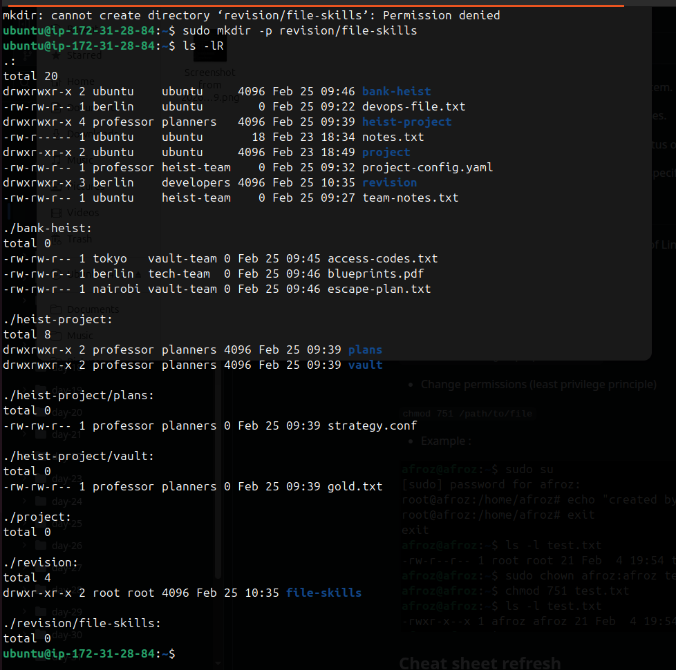

#  Revision 

### Process & Services

- `ps -aux` - to list all running processes. 
- `systemctl status service_name` - to get status of sevice.
- `journalctl -u service` - to get log of service help in debugging failure.

### File skills 

- `echo "write something" >> filename` - to append data into file.
- `chmod` - change permission of file/dir.
- `chown` - to change ownership 
- `ls -l` - 0to list dir/file with, flag -l to list with file permissions owner group date filename (with metadata)
- `cp source destination` - to copy file/dir.
- `mkdir ` - to make dir.

