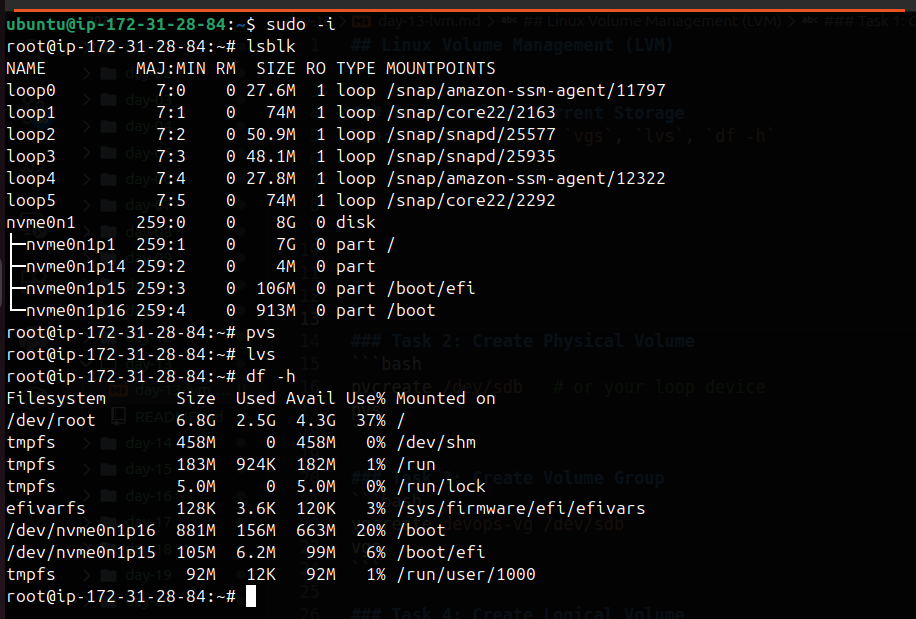
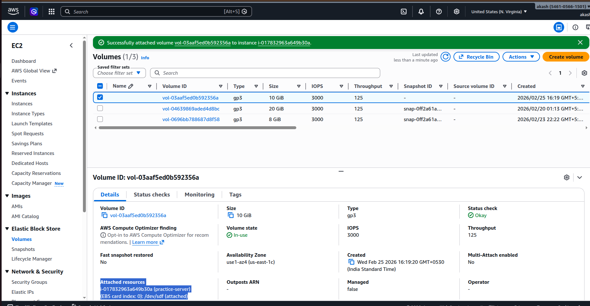
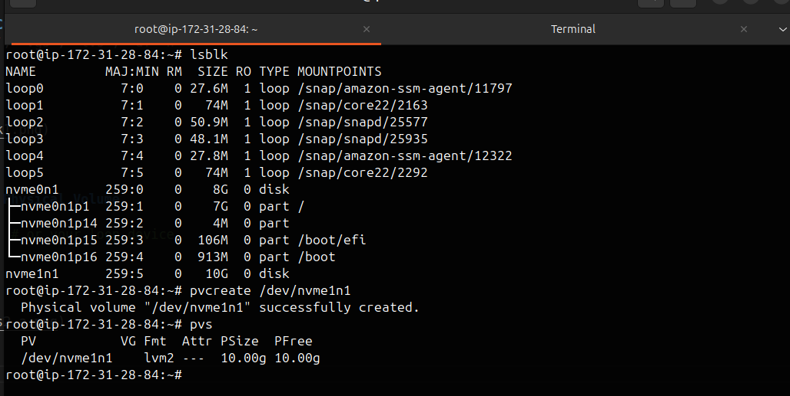
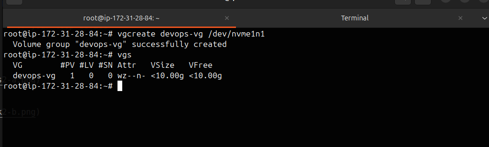
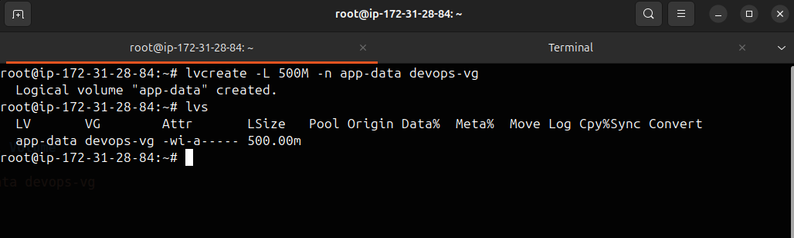
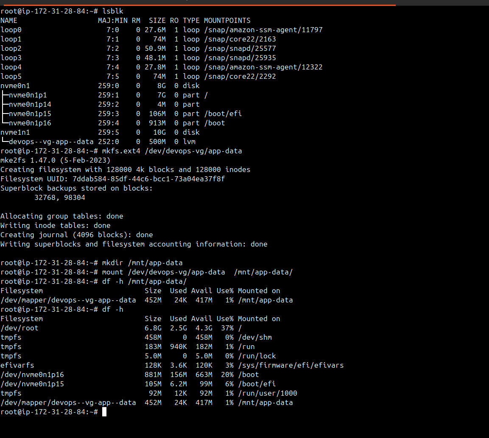
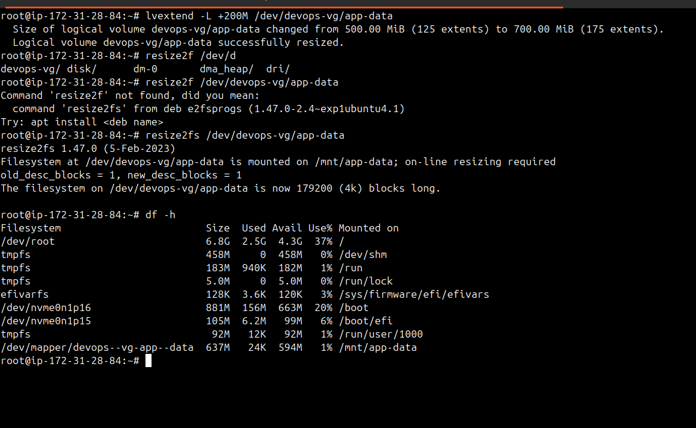
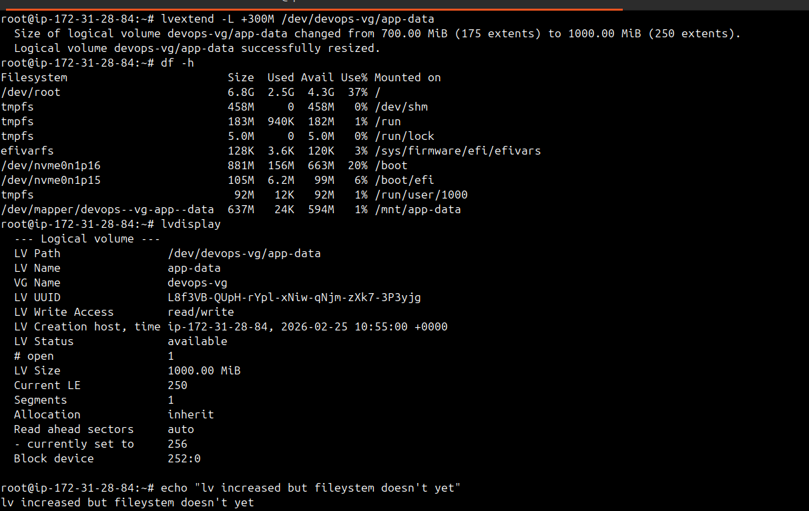
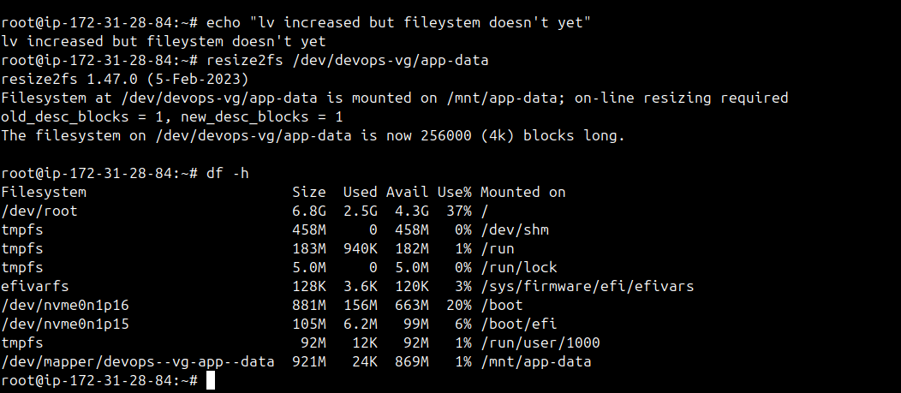

## Linux Volume Management (LVM)


### Task 1: Check Current Storage
Run: `lsblk`, `pvs`, `vgs`, `lvs`, `df -h`





### Task 2: Create Physical Volume
```bash
pvcreate /dev/sdb   # or your loop device
pvs
```

- Attaching volume



- Creating pv




### Task 3: Create Volume Group
```bash
vgcreate devops-vg /dev/sdb
vgs
```





### Task 4: Create Logical Volume
```bash
lvcreate -L 500M -n app-data devops-vg
lvs
```





### Task 5: Format and Mount
```bash
mkfs.ext4 /dev/devops-vg/app-data
mkdir -p /mnt/app-data
mount /dev/devops-vg/app-data /mnt/app-data
df -h /mnt/app-data
```





### Task 6: Extend the Volume
```bash
lvextend -L +200M /dev/devops-vg/app-data
resize2fs /dev/devops-vg/app-data
df -h /mnt/app-data
```





## Resizing







---


### What you learned (3 points)

- I have clearly understand attching volume, what are pv, vg, lv
- I learned how to create pv, vg, lv
- I learned how to create filesystem of lv or pv, and mounting them.
- I also learned new thing that when we increase logical volumes lv, we have to resize filesystem using `resize2fs lv_path` so that increased/decreased size also appear in `df -h`.

---