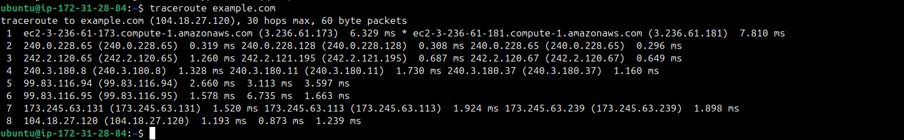
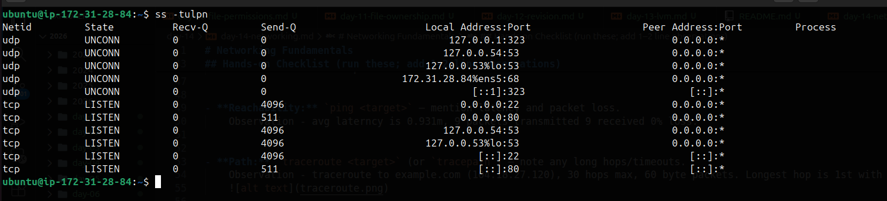
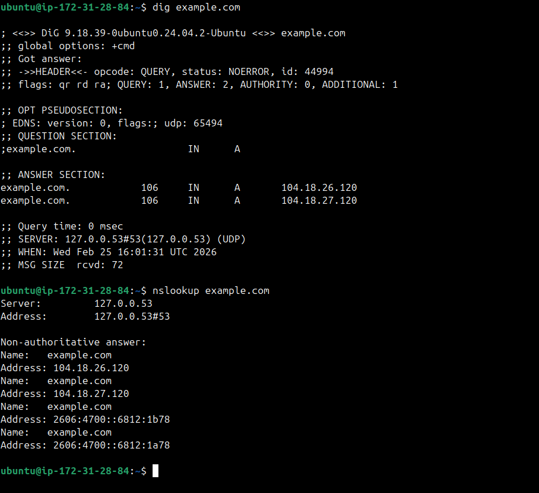
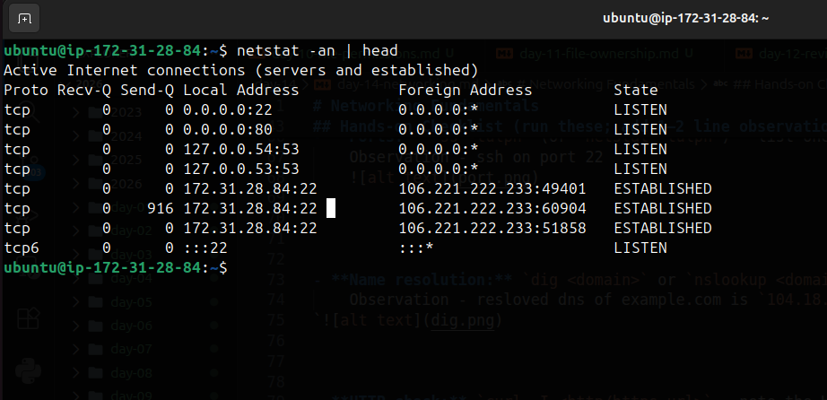
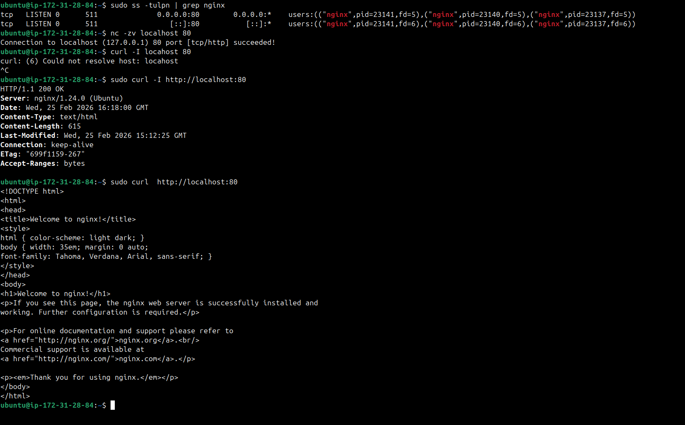

# Networking Fundamentals


## OSI vs TCP/IP Models

### OSI Model -
OSI model is theory that tell how computer system communicate over  network. OSI model has 7 layers:

- L7 Application - end user layer like browser, curl, postman
- L6 Presentation- Data format, encryption/decryption
- L5 Session - Establish/ manage / terminate session
- L4 Transport - Data transmit using TCP/UDP 
- L3 Network - IP addresses, routing, ICMP ping
- L2 Data Link - MAC addresses, ARP
- L1 Physical - Cables, NICs


### TCP/IP
TCP/IP Model is practically used. 

- L4 Application - Combine Application, Presentation, Session
- L3 Transport - same as Transport in OSI model
- L2 Internet - same as Network in OSI model
- L1 Network access - Combine Data link and Physical.


--- 


## Protocol Placement
- Application - HTTP/HTTPS, DNS, SSH, FTP, SMTP
- Transport - TCP, UDP
- Internet - IP, ICMP, ARP
- Network access- Ethernet, wifi


--- 


## Hands-on Checklist (run these; add 1–2 line observations)

- **Identity:** `hostname -I` (or `ip addr show`)
    Observation - local ip addr is `172.31.28.84` 


- **Reachability:** `ping <target>` — mention latency and packet loss.
    Observation - avg laterncy is 0.931m, 9 packets transmitted 9 received 0% loss.


- **Path:** `traceroute <target>` (or `tracepath`) — note any long hops/timeouts.
    Observation - traceroute to example.com (104.18.27.120), 30 hops max, 60 byte packets. Longest hop is 1st with 7.810ms
    


- **Ports:** `ss -tulpn` (or `netstat -tulpn`) — list one listening service and its port.
    Observation - ssh on port 22
    


- **Name resolution:** `dig <domain>` or `nslookup <domain>` — record the resolved IP.
    Observation - resloved dns of example.com is `104.18.26.120`
`


- **HTTP check:** `curl -I <http/https-url>` — note the HTTP status code.
    Observation -   `HTTP/1.1 200 OK`


- **Connections snapshot:** `netstat -an | head` — count ESTABLISHED vs LISTEN (rough).
    Observation - ESTABLISHED connections are 3, LISTEN connection are 5. ports are 22, 53, 80.
    


---

## Mini Task: Port Probe & Interpret
1) Identify one listening port from `ss -tulpn` (e.g., SSH on 22 or a local web app).  
2) From the same machine, test it: `nc -zv localhost <port>` (or `curl -I http://localhost:<port>`).  
3) Write one line: is it reachable? If not, what’s the next check? (e.g., service status, firewall).
    check status - `systemctl status nginx`
    check logs - `journalctl -u nginx`
    check firewall - `sudo ufw status` disable it or `sudo ufw allow 80`


    


---


## Reflection (add to your markdown)
- Which command gives you the fastest signal when something is broken?
Ans. - `ping`

- What layer (OSI/TCP-IP) would you inspect next if DNS fails? If HTTP 500 shows up?
Ans. -
```
 For DNS failures, I inspect the Application layer since DNS is an L7 protocol.For HTTP 500 errors, I also inspect the Application layer because the request reached the server and failed during processing.
```


- Two follow-up checks you’d run in a real incident.
Ans. 
    - Check service status `systemctl status nginx`
    - check logs `journalctl -u nginx`
    - check firewall `sudo ufw status`
    - check connectivity & port `curl -I url` `nc -zv ip port`