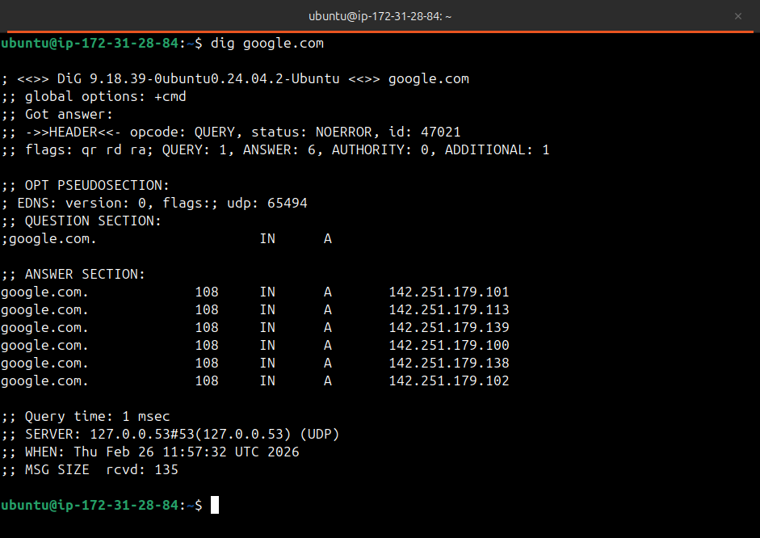
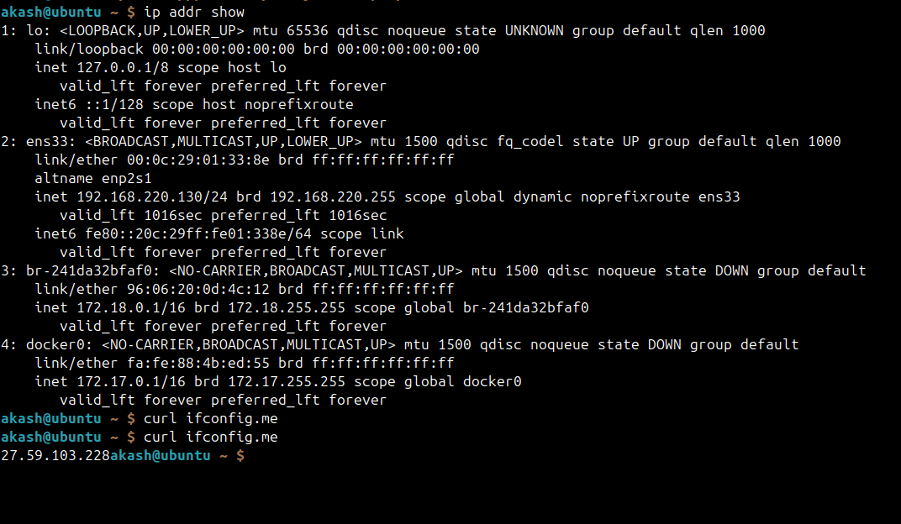
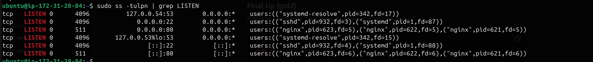

### Task 1: DNS – How Names Become IPs
1. Explain in 3–4 lines: what happens when you type `google.com` in a browser?
    Answer:-
    When you type google.com, the browser first checks its local cache (browser cache, OS cache, hosts file) for an IP address.
    If not found, it queries a DNS server to resolve the domain to an IP.
    The browser then establishes a TCP connection  TLS handshake andwith that IP.
    Finally, it sends an HTTP request, receives the response, and renders the webpage.


--
2. What are these record types? Write one line each:
   - `A` - Map a domain name to an IPv4 address.

   - `AAAA` - Map a domain name to an IPv6 address.


   - `CNAME`- Points one domain name to another domain name(alias)
   
   - `MX` - Specifies the mail server that handles email for domain.
   
   - `NS` - Defines the authoritative name servers for the domain .
These records are configured in the domain’s DNS zone file or DNS provider like Route 53, GoDaddy, or Cloudflare.


3. Run: `dig google.com` — identify the A record and TTL from the output



- A record - shows IPv4 `142.251.179.101`
- TTL - TTL is 108 sec

---

### Task 2: IP Addressing
1. What is an IPv4 address? How is it structured? (e.g., `192.168.1.10`)

    - An **IPv4 address** is a 32-bit numerical identifier used to uniquely identify a device on a network.
    Structure:
    -Written in dotted-decimal format
    -Consists of 4 octets, each 8 bits
    -Each octet ranges from 0 to 255

        Example:
        192.168.1.10 → 4 numbers separated by dots, together forming a 32-bit address.

    - An **IPv6 address** is a 128-bit numerical identifier used to uniquely identify devices on a network, designed to replace IPv4 due to address exhaustion.

        Structure:
        -Written in hexadecimal (0–9, a–f)
        -Consists of 8 groups, each 16 bits, separated by colons
        -Leading zeros can be omitted, and consecutive zero groups can be compressed with :: (once)

        Example:
        2001:0db8:85a3:0000:0000:8a2e:0370:7334
        can be written as 2001:db8:85a3::8a2e:370:7334


    An IP address is divided into two parts:
    **Network portion** → identifies the network
    **Host portion** → identifies the device within that network

    Example: 192.168.1.10/24
    Network portion: 192.168.1
    Host portion: 10

- Explanation:

    `/24` means the first 24 bits are fixed for the network
    The remaining 8 bits are used for host addresses
    All devices in this network share 192.168.1
    Each device has a unique host number (like 10, 20, 50)
    /24 means 8 bits are available for hosts
    `Formula: 2^(32 − 24) = 2^8 = 256`

- Usable IPs
Usable host IPs: 254
Network address: 192.168.1.0
Broadcast address: 192.168.1.255
Usable range
192.168.1.1  →  192.168.1.254

--
2. Difference between **public** and **private** IPs — give one example of each


| Feature            | Public IP                          | Private IP                         |
|--------------------|------------------------------------|------------------------------------|
| Definition         | IP address reachable over internet | IP address used inside a private network |
| Accessibility      | Accessible from anywhere           | Not accessible directly from internet |
| Uniqueness         | Globally unique                    | Unique only within local network   |
| Assigned by        | ISP or cloud provider              | Router / DHCP server               |
| Use case           | Hosting websites, public services  | Internal communication in LAN      |
| Example            | 8.8.8.8                            | 192.168.1.10                       |


--
3. What are the private IP ranges?

   - `10.x.x.x` - 10.0.0.0 – 10.255.255.255 (Large Enterprise Network)
   
   - `172.16.x.x – 172.31.x.x` - 172.16.0.0 – 172.31.255.255 (Medium size enterprise)
   
   - `192.168.x.x` - 192.168.0.0 – 192.168.255.255 (Home and small office Network)


4. Run: `ip addr show` — identify which of your IPs are private




- Loopback IP - `127.0.0.1` (localhost)
- Private IP - `192.168.220.130`  
- Docker Netwoek -  `172.17.0.1/16`


---

### Task 3: CIDR & Subnetting
1. What does `/24` mean in `192.168.1.0/24`?
    `/24` means the first 24 bits are used for the network portion, and the remaining 8 bits are for host addresses.


2. How many usable hosts in a `/24`? A `/16`? A `/28`?
```
Total IPs = 2^(32 − CIDR)
Usable Hosts = Total IPs − 2
```
`/24` → 256 total → 254 usable
`/16` → 65,536 total → 65,534 usable
`/28` → 16 total → 14 usable
(2 IPs are reserved for network and broadcast.)


3. Explain in your own words: why do we subnet?
    We subnet to divide a large network into smaller networks to improve performance, security(doesn't expose to publiv ip), and IP address management.


4. Quick exercise — fill in:

| CIDR | Subnet Mask       | Total IPs | Usable Hosts |
|------|-------------------|-----------|--------------|
| /24  | 255.255.255.0     | 256       | 254          |
| /16  | 255.255.0.0       | 65,536    | 65,534       |
| /28  | 255.255.255.240   | 16        | 14           |

---

### Task 4: Ports – The Doors to Services
1. What is a port? Why do we need them?
- A port is a logical number used to identify a specific service or application running on a device.
- One IP can run many services, and ports tell the OS which service should receive the traffic. 
- Ports help the OS route incoming traffic to the correct application.


2. Document these common ports:

| Port  | Service        |
|-------|----------------|
| 22    | SSH            |
| 80    | HTTP           |
| 443   | HTTPS          |
| 53    | DNS            |
| 3306  | MySQL          |
| 6379  | Redis          |
| 27017 | MongoDB        |


3. Run `ss -tulpn` — match at least 2 listening ports to their services





---

### Task 5: Putting It Together
Answer in 2–3 lines each:
- You run `curl http://myapp.com:8080` — what networking concepts from today are involved?
```
DNS resolution
myapp.com is resolved to an IP using DNS (A/AAAA record, TTL, cache).

Port usage
:8080 tells the OS to connect to port 8080, not the default HTTP port 80.

TCP connection
A TCP three-way handshake is established with the destination IP and port.

HTTP protocol
curl sends an HTTP request over that TCP connection.

Routing & IP networking
Packets are routed using IP addresses, subnets, and gateways. 
```


- Your app can't reach a database at `10.0.1.50:3306` — what would you check first?

```
- Check service status - `systemctl status mysql`
- Check is port open and serice is listening - `ss -tulpn | grep 3306`
- Check connectivity - `nc -zv 10.0.1.50:3306`
- Check logs - `journalctl -u mysql`


```

---

## Documentation

Create `day-15-networking-concepts.md` with:
- Your answers to each task
- Command outputs from `dig` and `ss`
- The filled CIDR table
- What you learned (3 key points)
