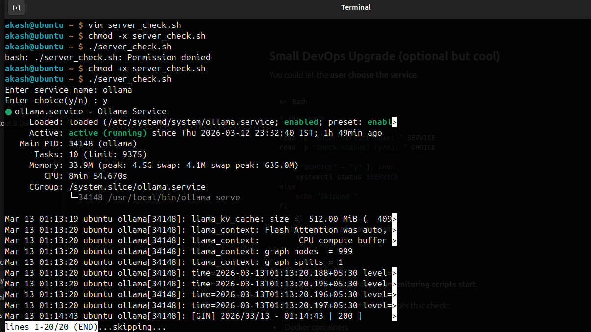

# Day 16 – Shell Scripting Basics

**Note: Scripts in `day-16/Scripts/*`**

### Task 1: Your First Script
1. Create a file `hello.sh`
2. Add the shebang line `#!/bin/bash` at the top
3. Print `Hello, DevOps!` using `echo`
4. Make it executable and run it

```bash
chmod +x hello.sh
./hello.sh
```

```
ubuntu@ip-172-31-66-154:~$ vim hello.sh 
ubuntu@ip-172-31-66-154:~$ ./hello.sh 
Hello, DevOps!
ubuntu@ip-172-31-66-154:~$ bash hello.sh 
Hello, DevOps!
ubuntu@ip-172-31-66-154:~$ 
```
**Document:** What happens if you remove the shebang line?
This time it worked but when we remove shebang (#!/bin/bash) , the system will use the default shell of the terminal to execute scripts.

---

### Task 2: Variables
1. Create `variables.sh` with:
    - A variable for your `NAME`
    - A variable for your `ROLE` (e.g., "DevOps Engineer")
    - Print: `Hello, I am <NAME> and I am a <ROLE>`

```
ubuntu@ip-172-31-66-154:~$ vim variables.sh 
ubuntu@ip-172-31-66-154:~$ chmod +x variables.sh 
ubuntu@ip-172-31-66-154:~$ ./variables.sh 
Hello, I am Akash and I am a DevOps Engineer.
ubuntu@ip-172-31-66-154:~$ vim variables.sh 
ubuntu@ip-172-31-66-154:~$ ./variables.sh 
Hello, I am Akash and I am a DevOps Engineer.
Hello, I am $NAME and I am a $ROLE.
```
2. Try using single quotes vs double quotes — what's the difference?
Double quotes allow variable substitutions.

---

### Task 3: User Input with read
**Create `greet.sh` that:**
    - Asks the user for their name using `read`
    - Asks for their favourite tool
    - Prints: `Hello <name>, your favourite tool is <tool>`

```
ubuntu@ip-172-31-66-154:~$ vim greet.sh
ubuntu@ip-172-31-66-154:~$ chmod +x greet.sh 
ubuntu@ip-172-31-66-154:~$ ./greet.sh 
Enter your name: Akash
Enter your favourite tool: Docker
Hello Akash, your favourite tool is Docker
ubuntu@ip-172-31-66-154:~$ 
```

---

### Task 4: If-Else Conditions
1. Create `check_number.sh` that:
   - Takes a number using `read`
   - Prints whether it is **positive**, **negative**, or **zero**

    ```
    ubuntu@ip-172-31-66-154:~$ vim check_number.sh 
    ubuntu@ip-172-31-66-154:~$ chmod +x check_number.sh 
    ubuntu@ip-172-31-66-154:~$ ./check_number.sh 
    Enter a number: -9
    The number is Negative.
    ubuntu@ip-172-31-66-154:~$ 
    ```


2. Create `file_check.sh` that:
   - Asks for a filename
   - Checks if the file **exists** using `-f`
   - Prints appropriate message
    ```
    ubuntu@ip-172-31-66-154:~$ vim file_check.sh
    ubuntu@ip-172-31-66-154:~$ chmod +x file_check.sh 
    ubuntu@ip-172-31-66-154:~$ ./file_check.sh 
    Enter filename: greet.sh
    File exists.
    ubuntu@ip-172-31-66-154:~$ ./file_check.sh 
    Enter filename: health.sh
    File does not exist.
    ubuntu@ip-172-31-66-154:~$ 
    ```


**Some Important Flags**
| Flag   | Meaning                                          |
|--------|--------------------------------------------------|
| -f     | regular file exists                              |
| -d     | directory exists                                |
| -e     | file or directory exists                        |
| -r     | file is readable                                |
| -w     | file is writable                                |
| -x     | file is executable                              |
| -s     | file not empty                                  |


---

### Task 5: Combine It All
Create `server_check.sh` that:
1. Stores a service name in a variable (e.g., `nginx`, `sshd`)
2. Asks the user: "Do you want to check the status? (y/n)"
3. If `y` — runs `systemctl status <service>` and prints whether it's **active** or **not**
4. If `n` — prints "Skipped."


